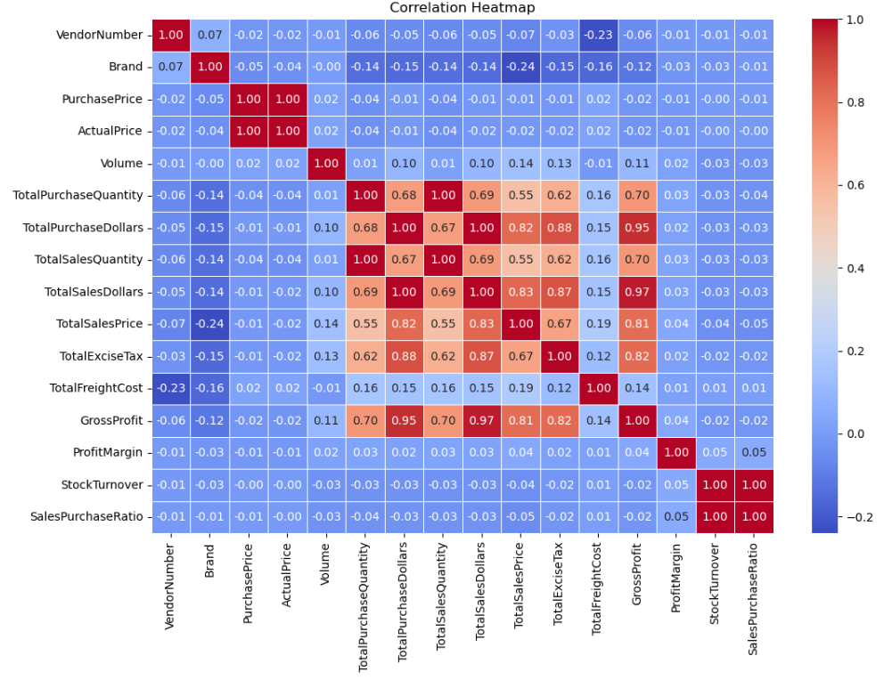
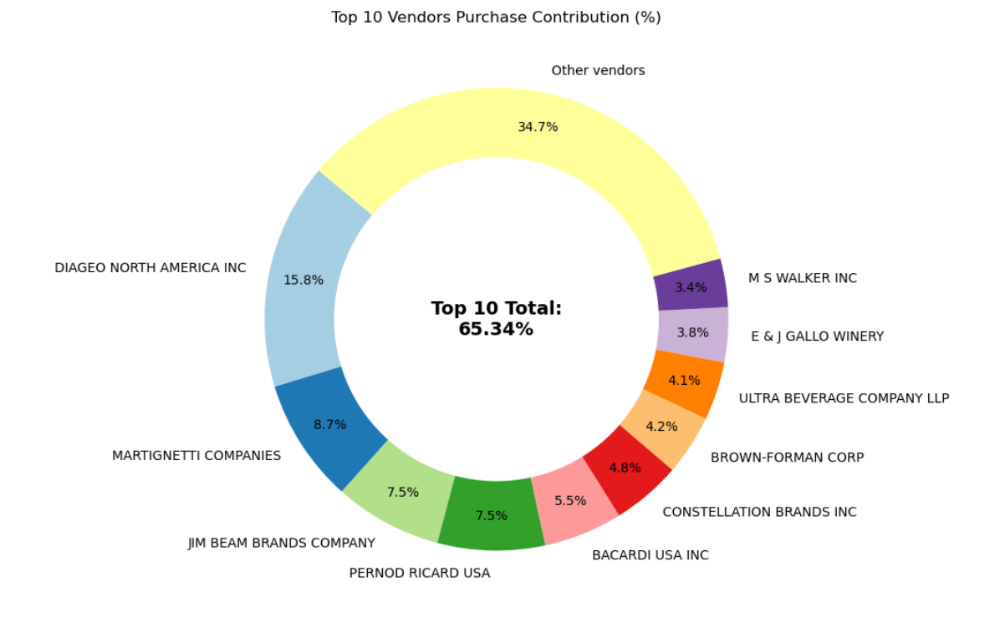
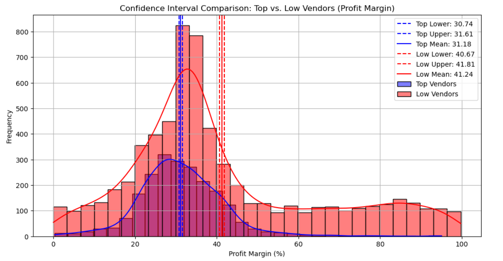
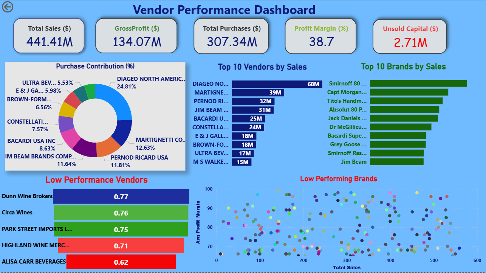

# 📊 Vendor Performance Analysis Dashboard

🚀 **Power BI | Data Analytics Project**

---

## 📌 Project Overview

This project focuses on analyzing vendor performance using **Power BI** to uncover insights related to sales, profitability, inventory efficiency, and purchasing patterns using SQL, Python and Power BI.

The goal is to transform raw data into **actionable business insights** that help organizations make better decisions.

---

## 🎯 Business Problem

The business faces challenges such as:

* Inefficient pricing strategies
* Poor inventory turnover
* Dependency on a few vendors
* Unsold or slow-moving stock

### 🔍 Key Questions Addressed:

1. Identify underperforming brands requiring pricing or promotion
2. Determine top vendors contributing to sales and profit
3. Analyze impact of bulk purchasing on cost
4. Evaluate inventory turnover efficiency
5. Compare profitability between high and low-performing vendors


---

## 🛠️ Tools & Technologies

* ⚡ SQL(CTE, Joins, Filtering)
* 📊 Power BI(Interactive Visualization)
* 🧠 Python(Pandas, Matplotlib, Seaborn, SciPy)

---


## 🔍 Exploratory Data Analysis (EDA)

### 📉 Data Issues Identified

* Negative gross profit values indicating losses
* Zero sales transactions (unsold inventory)
* High variation in freight costs (logistics inefficiencies)
* Presence of outliers in pricing and quantity


---

### 📊 Correlation Insights

* Weak relationship between **Purchase Price and Profit**
* Strong correlation (0.999) between **Purchase Quantity & Sales Quantity**
* Negative correlation between **Sales Price & Profit Margin**
* Stock turnover does not strongly impact profitability



---

## 📈 Key Insights

### 🟢 1. High Margin but Low Sales Products

* 198 brands have high profit margins but low sales
* Opportunity for promotions and pricing optimization

 

---

### 🟡 2. Vendor Dependency Risk

* Top 10 vendors contribute **~64% of total purchases**
* Heavy reliance increases supply chain risk

 

---

### 🔵 3. Bulk Purchasing Advantage

* Bulk buying reduces unit cost by **~72%**
* Encourages higher sales while maintaining margins

 

---

### 🔴 4. Slow-Moving Inventory

* Total unsold inventory value: **2.71M**
* Impacts storage cost and cash flow

 

---

### 🟣 5. Profit Margin Comparison

* Top vendors: ~31% margin
* Low-performing vendors: ~41% margin but low sales



---
## 📊 Dashboard Overview

### 🔥 Key KPIs:

* 💰 Total Sales: **441.41M**
* 📈 Gross Profit: **134.07M**
* 🛒 Total Purchases: **307.34M**
* 📊 Profit Margin: **38.7%**
* ⚠️ Unsold Capital: **2.71M**

The dashboard provides:

* Vendor-wise performance tracking
* Top & low-performing vendors
* Sales vs Profit analysis
* Top & low-performing brands


---

## 💡 Recommendations

* 📉 Optimize pricing for high-margin low-sales products
* 🔄 Diversify vendor base to reduce dependency
* 📦 Improve inventory management for slow-moving stock
* 📣 Enhance marketing strategies for low-performing brands
* 💰 Leverage bulk purchasing for cost efficiency

 

---

## 📚 Learning Outcomes

* ✔️ Hands-on experience with real-world datasets
* ✔️ Data cleaning and preprocessing techniques
* ✔️ Writing scripts for repeatative tasks
* ✔️ Doing EDA(Exploratory Data Analysis) for gaining insights
* ✔️ Designing interactive dashboards
* ✔️ Translating data into business insights

---


## 📊 Dashboard Overview



### 🔥 Key KPIs:

* 💰 Total Sales: **441.41M**
* 📈 Gross Profit: **134.07M**
* 🛒 Total Purchases: **307.34M**
* 📊 Profit Margin: **38.7%**
* ⚠️ Unsold Capital: **2.71M**

---


## 📂 Project Structure

```
📁 Vendor-Performance-Analysis
│
├── 📁 images
│   ├── dashboard.png
│   ├── eda_distributions.png
│   ├── correlation_heatmap.png
│   ├── high_margin_low_sales.png
│   ├── sample_table.png
│   ├── vendor_contribution.png
│   ├── bulk_pricing.png
│   ├── unsold_inventory.png
│   └── profit_margin_comparison.png
│
├── 📁 notebooks
│   └── eda_analysis.ipynb
│   └── vendor_performance_analysis.ipynb
│
├── 📁 scripts
│   ├── ingestion.py
│   ├── get_vendor_summary.py
│
├── 📁 logs
│   └── processing_logs.txt
│
├── 📄 Vendor Performance Report.pdf
├── 📄 README.md
└── 📊 Vendor Performance Dashboard.pbix
```


---

## 🚀 Conclusion

This project demonstrates how **data-driven decision making** can improve vendor performance, optimize inventory, and enhance profitability.

It marks my first step into **Business Intelligence and Data Analytics**, and I am continuously learning and improving 🚀

---

## 🤝 Connect With Me

If you found this project interesting or have suggestions, feel free to connect! 😊


🔗 Email : armanarzbegi3@gmail.com

🔗  ![LinkeIn] (https://www.linkedin.com/in/abdul-rehman-arzbegi/)

---
